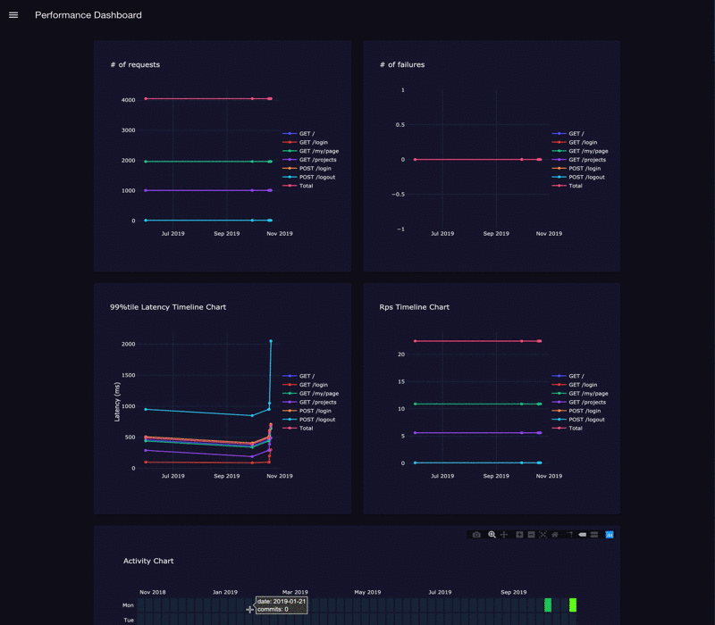

# Performance Dashboard

## Table of Contents

- [Introductions](#introductions)
- [Build Setup](#build-setup)

## Introductions

This is a simple tool for monitoring your web service performance.



All web developers are interested in your service performance, so we test services with performance tools like [JMeter](https://github.com/apache/jmeter), [Vegeta](https://github.com/tsenart/vegeta), [Locust](https://github.com/locustio/locust) and so on. Now, with growing container services, we can do performance test more easier because they provide exact same environments and scalability. It means we can monitor our service performance more easier continuously.

This tool is for monitoring performance based on [Locust](https://github.com/locustio/locust) reports. Although using a database and a visualization tool (e.g. [Elasticsearch](https://github.com/elastic/elasticsearch) and [Kibana](https://github.com/elastic/kibana), [MySQL](https://github.com/mysql) and [ReDash](https://github.com/getredash/redash)) is a option, but you may think preparing those just for monitoring performance is more expensive than developing a simple performance monitoring tool. If you think in a similar way, this tool is suitable because this requires storing reports in github repository and generates plots when starting the tool.

Of course you can use other performance tool reports by developing scripts for formatting its for plotting charts and adding it as a processor.

This tool requires you basic knowledge about the following:

<table>
  <thead>
    <th>Technology</th>
    <th>Usage</th>
  </thead>
  <tbody>
    <tr>
      <td>Python 3</td>
      <td rowspan="3">For plotting charts and processing test reports.</td>
    </tr>
    <tr>
      <td>Pandas</td>
    </tr>
    <tr>
      <td>Plotly</td>
    </tr>
    <tr>
      <td>javascript</td>
      <td rowspan="4">For developing web pages.</td>
    </tr>
    <tr>
      <td>Nuxt.js</td>
    </tr>
    <tr>
      <td>Vue.js</td>
    </tr>
    <tr>
      <td>Vuetify</td>
    </tr>
  </tbody>
</table>

## Build Setup

```bash
# install dependencies
$ yarn install

# serve with hot reload at localhost:3000
$ yarn run dev

# build for production and launch server
$ yarn run build
$ yarn run start

# generate static project
$ yarn run generate
```

For detailed explanation on how things work, check out [Nuxt.js docs](https://nuxtjs.org).
